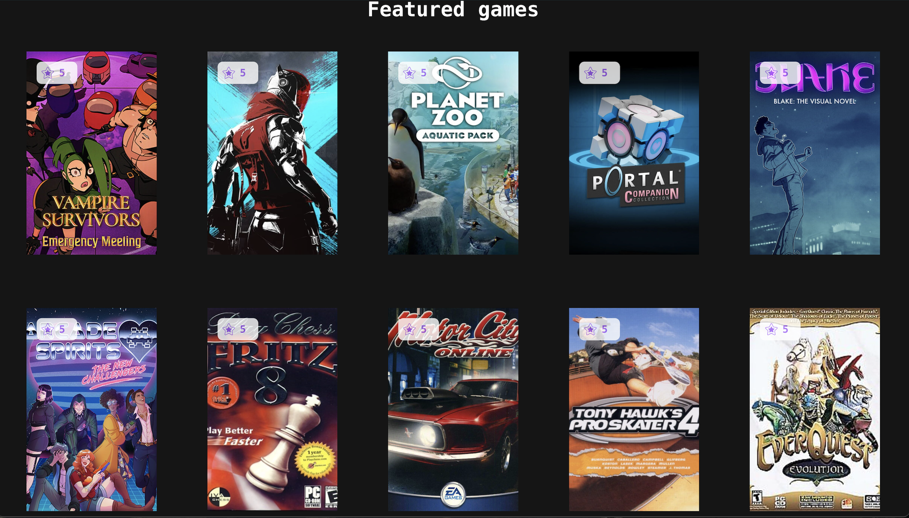
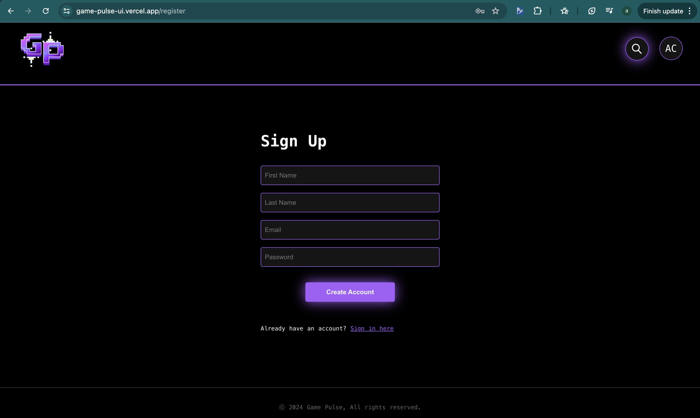
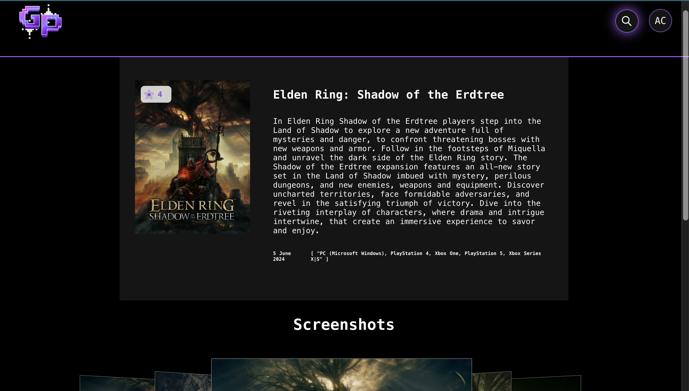
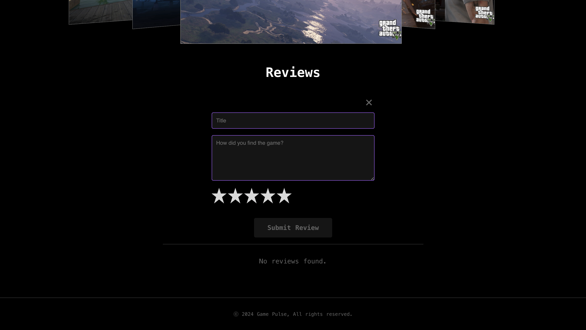

# Portfolio Project
## GameQuest




GameQuest is a platform where users can check the latest news and trends about video games and create accounts to review games they've played.

### Introduction

#### Inspiration
As a gamer, I noticed a gap in the market for a comprehensive platform that not only provides the latest games and trends but also fosters a community where gamers can share their experiences and insights. My vision for GameQuest is to create a one-stop destination for everything related to video games, driven by a passionate community.

#### The Journey
Building GameQuest was a journey filled with both technical challenges and rewarding milestones. My primary goal was to create a user-friendly platform that presents game data in an engaging and insightful manner. Along the way, I faced several challenges, from managing large datasets efficiently to ensuring a seamless user experience.

[Visit GameQuest](game-pulse-ui.vercel.app)


Connect with me on LinkedIn:
- [Bibiresanmi Oluwagbenga David](https://www.linkedin.com/in/david-bibiresanmi-b7a6a4249/)

### Installation

To run GameQuest locally, follow these steps:

1. Clone the repository:
   ```bash
   git clone https://github.com/BIBIREDAVID/Game_Quest
   ````
2. Install server dependencies:
    ```bash
    cd Game_Quest/server/
    npm install
    ````
3. Install frontend dependencies:
    ```bash
    cd ../frontend
    npm install
    ````
4. Set up environment variables:
Create a .env file in the server directory and add your configuration

5. Start the server:
    ```bash
    cd ../server
    npm start
    ````
6. Start the frontend:
    ```bash
    cd ../frontend
    npm run dev
    ```
7. Open your browser and go to `http://localhost:3000` (or whatever port you chose).

### Usage
Once GameQuest is up and running, you can:

Browse Latest games: Check the latest titles and trends about video games.
Review Games: Create an account and start reviewing games you've played.

### Contributing
To contribute to GameQuest, follow these steps:
1. Fork the repository.
2. Create a new branch:
    ```bash
    git checkout -b feature-name
    ````
3. Make your changes and commit them:
    ```bash
    git commit -m "Description of your changes"
    ````
4. Push to the branch:
    ```bash
    git push origin feature-name
    ````
5. Open a Pull Request on GitHub.

### Related Projects:
Not available yet!

### Licensing
This project is licensed under the MIT License.

### Screenshots






### Next Steps
In addition to working on the current features to ensure a smooth user experience, I have a few other features in mind that could be a game changer, such as, personalized game lists for each user as well as more user interactions options like likes and comments on eachother's reviews.

### Reflections
Building GameQuest has been an incredible learning experience. I faced a lot of challenges, from handling large datasets to ensuring a responsive user interface, and each obstacle taught us valuable lessons. Moving forward, I am excited to continue improving GamePulse and adding new features that will enhance the user experience.

Thank you for visiting GameQuest. I hope you enjoy using this platform as much as I enjoyed building it.